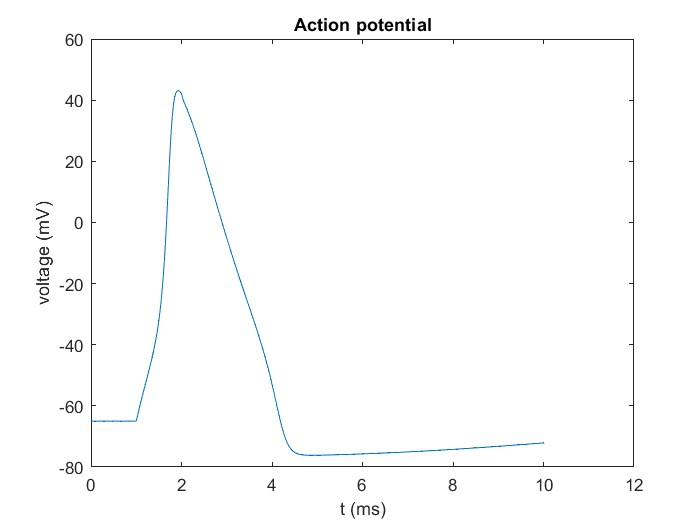

# NEURON Toolbox for MATLAB

> :warning: For now, only Windows with MinGW is supported.

The NEURON Toolbox provides a MATLAB API to NEURON, using the MATLAB 
provided clibgen and clib packages to connect MATLAB and NEURON.

The [NEURON simulation environment](https://www.neuron.yale.edu/) is used 
in laboratories and classrooms around the world for building and using 
computational models of neurons and networks of neurons.

About this toolbox:

- The +neuron package defines the MATLAB API to NEURON. All calls to 
  NEURON from MATLAB should only use methods and properties exposed by 
  the classes in this package and should not directly use clib.neuron. 
  This is because the +neuron package takes care of proper initialization 
  of NEURON, and correct cleanup of NEURON objects.
- With clib, the NEURON shared library can be used through the clibgen 
  generated wrapper interface. The functions and variables exposed in the 
  wrapper interface can be used directly from MATLAB, e.g. it is possible 
  to call the NEURON function nrn_sec_pop from MATLAB with 
  `clib.neuron.nrn_sec_pop()`.
- With clibgen a MATLAB interface to the NEURON library is built. This 
  results in a wrapper shared library. Prebuilt wrappers for certain 
  Operating System and Compiler combinations may be provided.
    - To generate the interface, the underlying library should preferably 
      expose an API in a header file. Since NEURON itself does not provide 
      a C or C++ API that is directly useable in clibgen, the MATLAB-NEURON 
      project also contains header and C++ files that define a C++ API, 
      containing the NEURON functionality that needs to be available from 
      MATLAB.


MATLAB is a registered trademark of The MathWorks, Inc. 

For more detailed technical information about e.g. code structure, see [doc/DEV_README.md](doc/DEV_README.md).

## Usage

### Setup

First, make sure NEURON for Windows is installed (see http://neuron.yale.edu/).

To get the toolbox working on your machine, run the MATLAB scripts in the following order:
- **setup** 
    - to add the appropriate directories to your path (you might need to
      change the NEURON installation directory)
    - **this script needs to be run every time a new MATLAB session is started**
- **build_interface**
    - to build the library interface (neuron/neuronInterface.dll)
    - **this script needs to be run only once to generate the library interface**,
      it only needs to be re-run if the interface changes (for example when using a newer Neuron version)

### Example scripts

A comprehensive example live script can be found at **examples/example_livescript.mlx**.

Smaller example scripts are available at:
- **examples/example_run** 
    - to initialize a Neuron session and call some top-level functions from the library
- **examples/example_vector** 
    - to create a Vector object and calculate some properties
- **examples/example_morph** 
    - to generate a morphology by connecting different Sections
- **examples/example_acpot** 
    - to generate an action potential

**example_acpot** should result in:



### Basic API usage

The main Neuron class can be found at `neuron.Neuron`. We can
initialize a Neuron session by instantiating it:

```matlab
n = neuron.Neuron();
```

Now all top-level variables, functions and classes can be accessed
using this object. The available variables, functions and classes, as 
well as their Neuron types can be displayed with:

```matlab
n.list_functions();
```

Top-level variables, functions and objects can be called directly. E.g.:

```matlab
disp(n.t);                  % Display the time
n.fadvance();               % Advance by one timestep
v = n.Vector();             % Create a Vector object
```

If you create an object like a Vector, you can see a list of its 
properties and methods with:

```matlab
v.list_methods();
```
